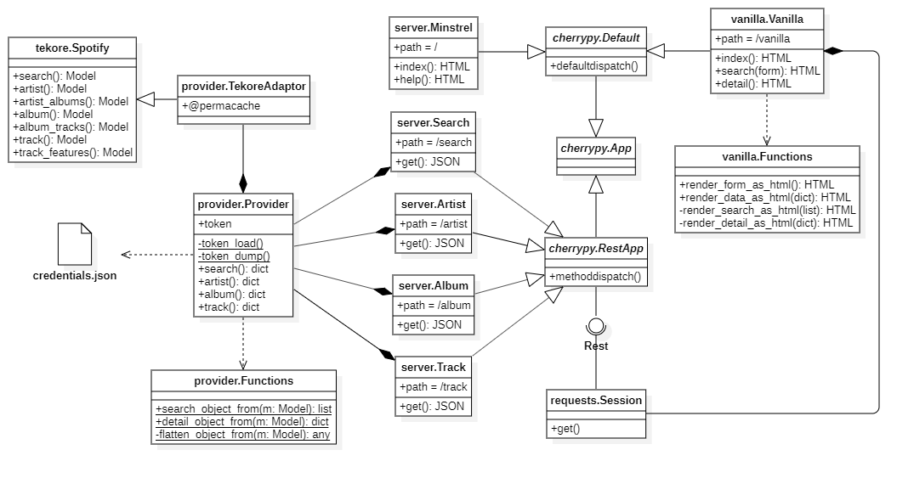

# AskMinstrel

A simple web client application to retrieve music related information.  A plain
 HTML implementation, called Vanilla is provided.  A vue.js application is considered
 but not fully developed.  A local web server provides end points and data marshalling
 for clients.

SWENG861 Project, AskMinstrel  
  André Wagner  
  July, 2020  

## Attributions

The project directly makes use of the following packages:  

* [CherryPy](https://pypi.org/project/CherryPy/) A Python HTTP framework and server.  
* [Tekore](https://pypi.org/project/tekore/) A Python client for the Spotify API.  
* [Requests](https://pypi.org/project/requests/) A library for HTTP/1.1 requests.  
* [Slugify](https://pypi.org/project/python-slugify/) Generate URI compatible strings.  

Content provided by [Spotify](https://developer.spotify.com/)

## Class Diagram



## Setup

Since a setup.py is not provided, the following manual setup is required.  

1. install python 3.6
2. unzip askminstrel.zip contents to a new directory
3. pip install  cherrypy
4. pip install tekore
5. pip install requests
6. pip install python-slugify

## Credentials

AskMinstrel requires a credentials.json file in the current working directory.
 See [Spotify](https://developer.spotify.com/) for information on how to obtain
 a client id and secret.  The file contents should look like:

``` json
{
    "client_id": "...",
    "client_secret": "..."
}
```

## Execution

AskMinstrel is a Python module that can be executed with

``` shell
python -m askminstrel
```

For available command line parameters

``` shell
python -m askminstrel -h
```

By default, the AskMinstrel server will use port 50861.  So direct a web browser
 to http://localhost:50861/vanilla and ask minstrel!
